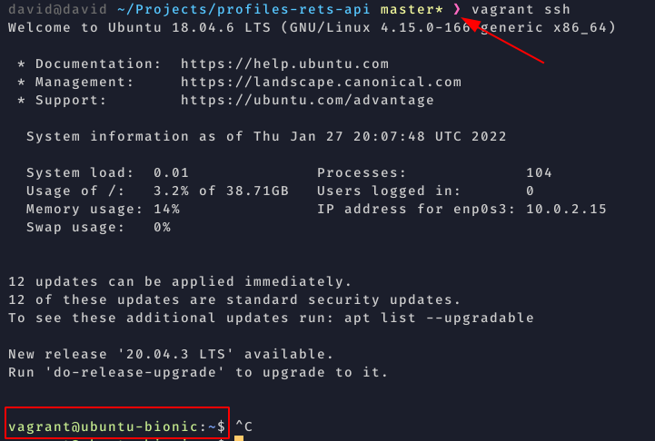

# Build a Backend REST API with Python and Django

## Technologies

We will use Vagrant in order to create a developer environment. 

Vagrant is a tool for building and managing virtual machine environments in a single workflow. With an easy-to-use workflow and focus on automation.

Vagrant provides easy to configure, reproducible, and portable work environments built on top of industry-standard technology and controlled by a single consistent workflow to help maximize the productivity and flexibility of you and your team.

Thanks to vagrant all the team can work under same conditions: same dependencies, versions, etc...

Vagrant use virtualization technology to isolate the application from the machine that is running on, so it is so similar to docker...

### Vagrant vs docker 

- Docker

is an open source containerization tool that allows you to run your application in a lightweight image. It works by creating a docker file that contains all the steps required to build the image to run our app. So docker install all of the dependencies and code required to run our app. Once you get your image u can run it on your local machine or deploy to a production server, because docker is designed to run in production.

- Vagrant 

Is a tool used for managing virtual machine environments but it doesn't come with any virtualization technology so vagrant works using something called a hypervisor such as virtual box, which run virtual machines on your computer. As docker vagrant works using a vagrant file which contains all of the instructions for creating your development server, so vagrant use a hyervisor to create a and configure the server on your machine. Vagran is not created for using in production.

## Creating a development environment with vagrant 

1. We must have installed virtual box and vagrant on our machine. 

```
sudo apt install virtualbox

curl -fsSL https://apt.releases.hashicorp.com/gpg | sudo apt-key add -
sudo apt-add-repository "deb [arch=amd64] https://apt.releases.hashicorp.com $(lsb_release -cs) main"
sudo apt-get update && sudo apt-get install vagrant
```
2. 
Once it is done to initialize our vagrant project we must indicate which operating system are we going to use to set up our server. There are many images available on vagrant cloud (https://app.vagrantup.com/boxes/search)

```
vagrant init ubuntu/bionic64
```
this command will create a file called `Vagrantfile` on there are all configurations for the development server. An example of this file could be:

```Vagrant

# -*- mode: ruby -*-
# vi: set ft=ruby :

# All Vagrant configuration is done below. The "2" in Vagrant.configure
# configures the configuration version (we support older styles for
# backwards compatibility). Please don't change it unless you know what
# you're doing.
Vagrant.configure("2") do |config|
 # The most common configuration options are documented and commented below.
 # For a complete reference, please see the online documentation at
 # https://docs.vagrantup.com.

 # Every Vagrant development environment requires a box. You can search for
 # boxes at https://vagrantcloud.com/search.
 config.vm.box = "ubuntu/bionic64"
 config.vm.box_version = "~> 20200304.0.0"

 config.vm.network "forwarded_port", guest: 8000, host: 8000

 config.vm.provision "shell", inline: <<-SHELL
   systemctl disable apt-daily.service
   systemctl disable apt-daily.timer
 
   sudo apt-get update
   sudo apt-get install -y python3-venv zip

   touch /home/vagrant/.bash_aliases
   if ! grep -q PYTHON_ALIAS_ADDED /home/vagrant/.bash_aliases; then
     echo "# PYTHON_ALIAS_ADDED" >> /home/vagrant/.bash_aliases
     echo "alias python='python3'" >> /home/vagrant/.bash_aliases
   fi
 SHELL
end

```

2.1 

```
 config.vm.box = "ubuntu/bionic64"
 config.vm.box_version = "~> 20200304.0.0"
```
in this 2 lines we specifie that virtual box will download a follow version of our SSOO and we pin a version to avoid possibles changes on the images.

2.2

```
 config.vm.network "forwarded_port", guest: 8000, host: 8000
```

this line map our port on local machine(host) to virtual machine(guest). By default any guess machine port are accesible so with this line we can map both ports and when i hit localhost:8000 it is linked to the port on virtual machine


2.3
   
here we install python3 and create an alias.
```
config.vm.provision "shell", inline: <<-SHELL
   systemctl disable apt-daily.service
   systemctl disable apt-daily.timer
 
   sudo apt-get update
   sudo apt-get install -y python3-venv zip

   touch /home/vagrant/.bash_aliases
   if ! grep -q PYTHON_ALIAS_ADDED /home/vagrant/.bash_aliases; then
     echo "# PYTHON_ALIAS_ADDED" >> /home/vagrant/.bash_aliases
     echo "alias python='python3'" >> /home/vagrant/.bash_aliases
   fi
 SHELL
```

3. 

Now we can initialize our virtual machine using 

```
vagrant up
```

to stop our virtual machine 

```
vagrant suspend
```

it will download our ssoo and install it on virtual box. Now we can connect to the vagrant server by using the vagrant ssh command.

```
vagrant ssh
```
it will allows us to login into your server and a prompt like ths will appear



to exit, hit exit

```
exit
```

1. once our server is up and running in it we will find out a copy of all our files of the local project folder on our server specifictly in this path `/vagrant`. Vagrant will keep syncronized the server with our local project.

**IMPORTANT**
to create our virtual environment for django apps we must create it in our user directory 

```
python3.8 -m venv ~/venv_profiles_api
```
One all this is set up we can create our django project(as usually)

but for run our server:

```
python manage.py runserver 0.0.0.0:8000
```

because we set on vagrantfile that we will use port 8000 to connect with virtual machine. To access on our local we can do it by `127.0.0.0:8000` may be firstly we must allowed this urls on our django setting file.